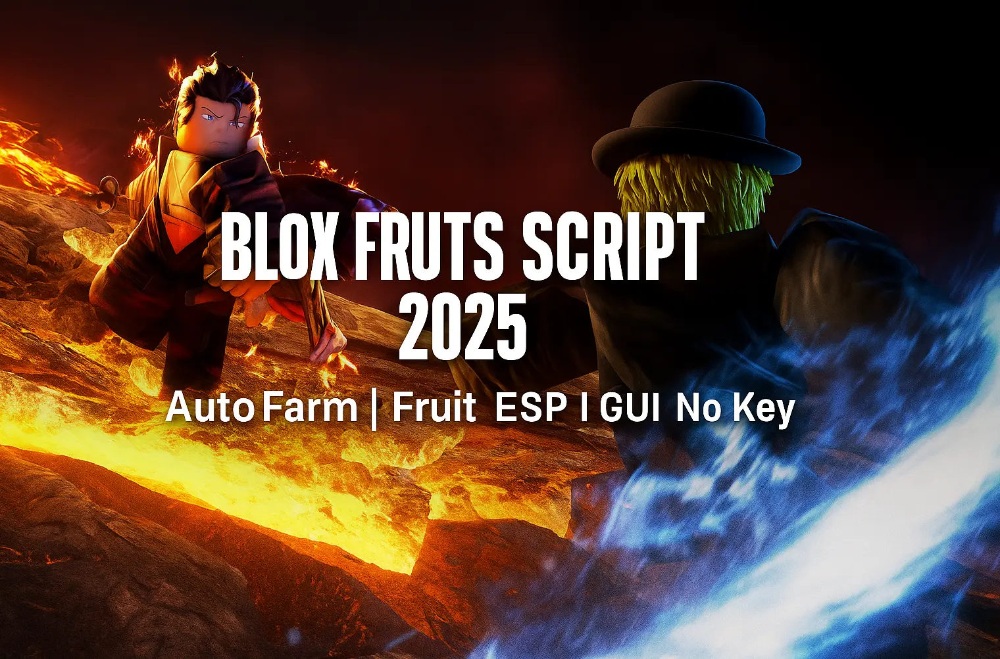

# 🍍 Blox Fruits Script Hub – Full GUI, Auto Farm, ESP & More

> 📦 Everything you need to dominate in Blox Fruits — auto level, boss tracking, teleport, infinite energy, all inside one repo.

*alt: Main script interface with tabs for auto farm, teleport, and ESP in Blox Fruits*

---

## 🎯 What’s Included in This Repository?
This GitHub repo bundles the most effective Blox Fruits scripts:
- 🔥 **Auto Farm** – Complete quests and level up with zero input
- ✈️ **Teleport Hack** – Move instantly to any island, NPC, or boss
- 👑 **Boss Finder ESP** – Track real-time spawns in Sea 1, 2, and 3
- 💨 **Infinite Energy** – Remove stamina limits, dash nonstop
- 🎛 **Universal GUI** – All features in one beautiful interface

Scripts are regularly updated and tested on Synapse X, Fluxus, Arceus X.

---

## 💻 Why Use This Repo?
- Human-written README files (SEO-optimized)
- Alt-tagged images and Markdown tables
- All tools in one place — no external scripts required
- Great for mobile and PC executors

---

## 🛠 Quick Access to Scripts

| Script           | Link to README                     |
|------------------|------------------------------------|
| Auto Farm        | [README_Auto_Farm.md](README_Auto_Farm.md) |
| Teleport Hack    | [README_Teleport_Hack.md](README_Teleport_Hack.md) |
| Boss Finder      | [README_Boss_Finder.md](README_Boss_Finder.md) |
| Infinite Energy  | [README_Infinite_Energy.md](README_Infinite_Energy.md) |
| Universal GUI    | [README_Universal_GUI.md](README_Universal_GUI.md) |

---

## 🔍 Search Tags
`blox fruits script`, `bloxfruit auto farm gui`, `teleport to boss blox fruits`, `blox fruit hack roblox`, `boss esp gui`, `lua mobility boost`, `fps unlock blox fruits`, `all in one script hub`

---

## ⚠️ Disclaimer
All content is provided for educational demonstration and Lua scripting practice. This is a non-commercial repository for sandbox testing only.

