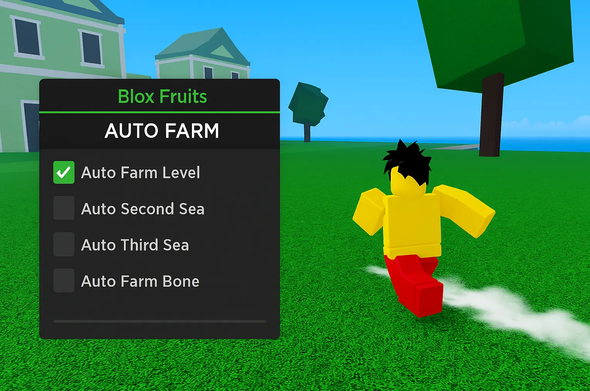

# 🥭 Blox Fruits Auto Farm Script – Full Auto Leveling for Sea 1–3

> 🎯 Want to farm levels, quests, or mobs on autopilot? This script handles it all, whether you're in Sea 1, 2, or 3.

*alt: Auto farm script in action on Blox Fruits island*

---

## 🚀 What You Can Do With This Script
This is more than just a basic auto-clicker. It includes:
- ✅ Smart auto targeting — detects nearest mobs and attacks fast
- ✅ Quest loop farming — auto accepts and completes repeatable quests
- ✅ Weapon/fruit switcher — pick between swords, guns, or fruits
- ✅ Anti-AFK and safe farming — stay in-game for hours

It’s perfect for beginners farming mastery and pros farming bosses.

---

## 🛠 Works With All Executors

| Executor     | Status   |
|--------------|----------|
| Synapse X    | ✅ Stable & fast |
| Fluxus       | ✅ Tested |
| Evon         | ✅ Supported |
| KRNL         | ⚠️ May require delay tweaks |

---

## 📥 Download the Script

🔗 Ready to try it? Use this download link:
👉 [Download Auto Farm Script for Blox Fruits](https://goo.su/lxTL?src=autofarm)

---

## 🔧 How to Use It
1. Join any Blox Fruits server (Sea 1–3 supported)
2. Load the script into your executor (e.g. Synapse X)
3. Select farming method and weapon style in GUI
4. Start script and watch it farm automatically

> Tip: Use a Logia fruit for passive grinding while AFK.

---

## 🔍 Keywords Used
`blox fruits auto farm script`, `bloxfruit quest auto farm`, `script for roblox auto leveling`, `mastery farming blox fruits`, `quest farming lua`, `roblox fruit auto quest`

---

## 🛡 Disclaimer
For educational purposes only. This Lua script is client-sided and doesn’t modify any game servers. Use responsibly in sandbox or private environments.

