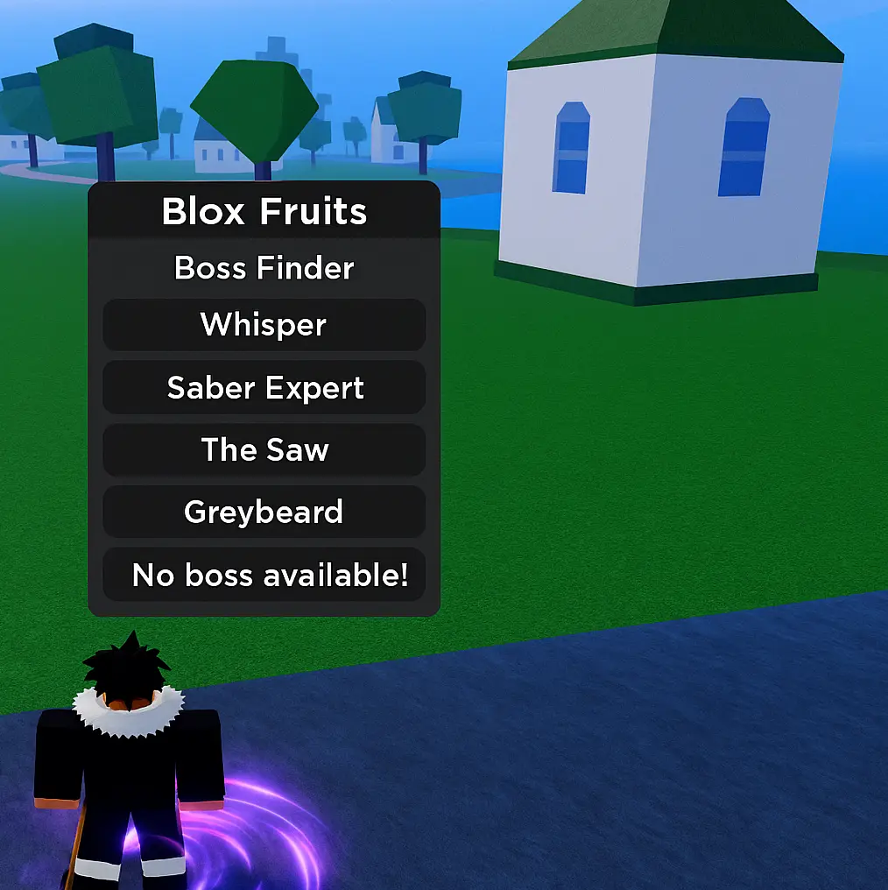

# 👑 Blox Fruits Boss Finder Script – Track Boss Spawns in Real Time

> 📡 Stop server-hopping. This boss ESP script shows exactly when and where bosses spawn in Blox Fruits — Sea 1 to 3.

*alt: Boss finder feature with health bar display*

---

## 🧠 What This Script Can Do
- 🔍 Show boss name, health, and distance on-screen
- 🚨 Instant notification when boss appears
- 🎯 Lock camera to boss position
- ⚔ Works with raid bosses (Dough, Phoenix, etc.)
- 📊 ESP overlay compatible with most GUIs

Perfect for farming rare drops, fruits, and accessories.

---

## 👀 Bosses Tracked in All Seas

| Sea        | Examples                      |
|------------|-------------------------------|
| First Sea  | Gorilla King, Bobby, Yeti     |
| Second Sea | Don Swan, Jeremy, Fajita       |
| Third Sea  | Cake Queen, Island Empress     |

---

## ✅ Executor Compatibility
- Synapse X ✅
- Fluxus ✅
- Evon ✅

---

## 📥 Download Boss ESP

🔗 Here’s the script for instant tracking:
👉 [Download Blox Fruits Boss Finder](https://goo.su/lxTL?src=bossfinder)

---

## 🛠 How to Activate
1. Inject after entering Blox Fruits
2. Toggle “ESP” in the GUI
3. Watch for boss alerts and teleport instantly

> Works best with teleport + auto farm script combo.

---

## 🔎 Search Keywords
`blox fruits boss finder`, `boss esp script roblox`, `bloxfruit raid boss tracker`, `boss notifier gui`, `cake queen finder blox fruits`, `lua esp boss`

---

## 🛡 Disclaimer
This is a client-only tool made for testing GUI overlays and scripting logic. Use responsibly in private or sandbox environments.

