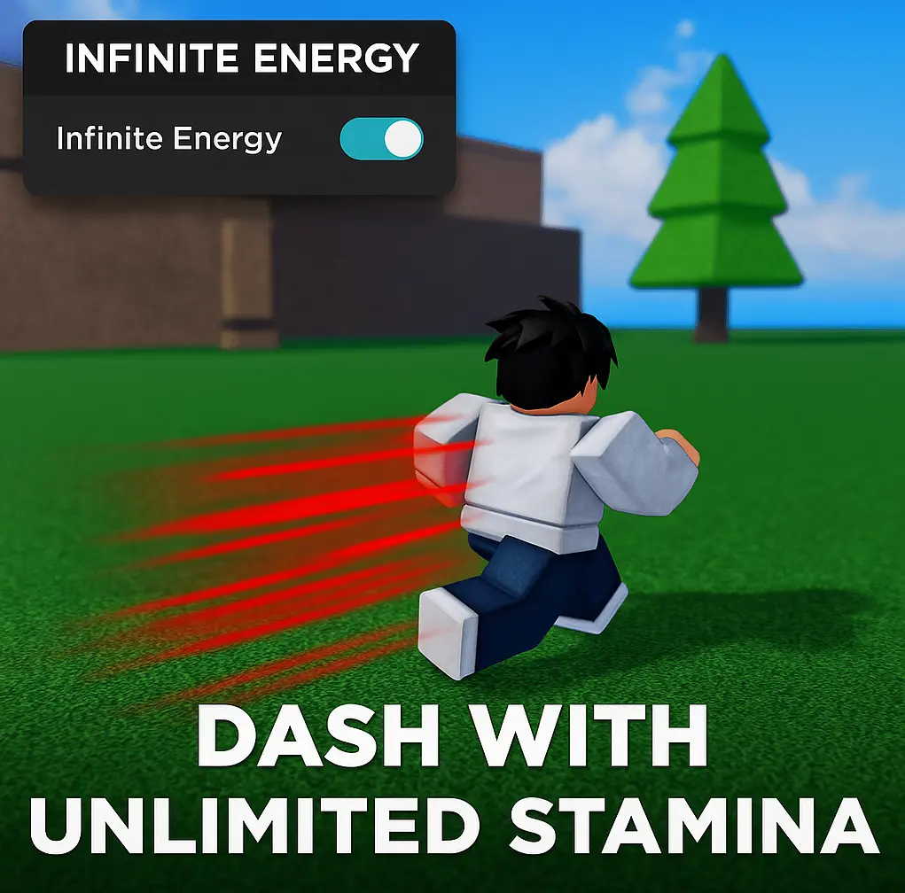

# ⚡ Infinite Energy Script – No Cooldowns, Full Speed Movement in Blox Fruits

> 🌀 Whether you’re dashing around Sea 2 or farming raids in Sea 3, this script removes energy limits so you never stop moving.

*alt: Script enabling infinite energy and auto dash*

---

## 🔋 Why Use an Energy Bypass Script?
Running out of stamina mid-combo is annoying. This script gives you:
- 🔁 Infinite dash / Geppo without delay
- 💨 Faster movement in PvE and PvP
- 🔋 Skills and special moves cost 0 energy
- 🛡 Safe usage: purely local client-side effect

Tested on land, air, and water-based zones — works like a charm.

---

## ⚙️ Key Perks at a Glance

| Feature           | Benefit                              |
|------------------|---------------------------------------|
| Infinite Dash     | Spam dash/fly with no stamina drain  |
| Energy Freeze     | Special moves don’t use stamina       |
| PvP Optional Mode | Doesn’t affect server sync            |
| Works in Raids    | Keep speed while dodging attacks      |
| Lightweight       | Doesn’t slow your device              |

---

## ✅ Tested On:
- Synapse X ✅
- Fluxus ✅
- Delta ✅
- Hydrogen (mobile) ✅

---

## 📥 Download Infinite Dash

🔗 Boost your mobility now:
👉 [Download Blox Fruits Infinite Energy](https://goo.su/lxTL?src=infiniteenergy)

---

## 📚 Quick Setup Guide
1. Launch Roblox and enter Blox Fruits
2. Inject script after full load screen
3. Dash, jump, spam Geppo — no energy bar needed

> Combine this with teleport or GUI script for full mobility control.

---

## 🔎 Related Searches
`blox fruits infinite dash script`, `energy bypass roblox`, `lua stamina hack`, `no cooldown blox fruits`, `bloxfruit movement boost`, `geppo dash lua`

---

## 🛡 Notice
This script is for mobility testing and script development use only. It does not modify multiplayer server data. Always use responsibly.

