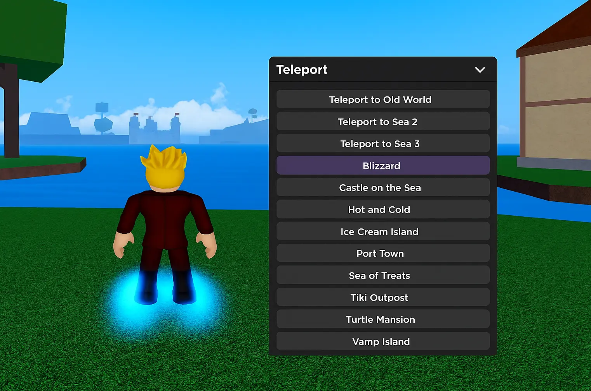

# 🌍 Blox Fruits Teleport Script – Instantly Move Between Islands, NPCs, and Seas

> ⚡ Skip the grind. With this teleport GUI script, you can travel between any island or NPC instantly — from Sea 1 to Castle on the Sea.

*alt: Teleport menu showing instant island selection in Blox Fruits*

---

## ✈️ What This Script Lets You Do
- 🗺 Instantly teleport to any major island or quest NPC
- ⚔️ Jump directly into boss zones or raid locations
- 💾 Save custom waypoints to revisit later
- 🛡 Safe mode to prevent enemy detection when teleporting
- 🎛 GUI toggle to show/hide with a hotkey

Works on all seas and is ideal for questing or fruit hunting.

---

## 📋 Supported Teleport Zones

| Area            | Description                        |
|------------------|------------------------------------|
| First Sea        | Jungle, Marine, Sky Island, etc.  |
| Second Sea       | Café, Kingdom, Factory, etc.      |
| Third Sea        | Castle on the Sea, Floating Turtle|

---

## ✅ Compatible Executors
- Synapse X ✅
- Fluxus ✅
- Electron ✅
- KRNL ⚠️ (some features limited)

---

## 📥 Download Teleport GUI

🔗 Use this version for fast island hopping:
👉 [Download Blox Fruits Teleport Script](https://goo.su/lxTL?src=teleport)

---

## 🛠 How to Use
1. Join Blox Fruits and wait for full load
2. Load the script with your executor
3. Use GUI to select any zone or NPC
4. Boom — you’re there

> Tip: Combine with boss ESP to jump straight into fights.

---

## 🔎 Key Search Terms
`blox fruits teleport script`, `bloxfruit travel GUI`, `roblox island jump hack`, `lua teleport to boss`, `castle on the sea teleport`, `npc warp blox fruits`

---

## 🛡 Use Responsibly
Created for educational use, testing GUI workflows, and exploring sandbox features in Roblox. Do not abuse in public matches.

