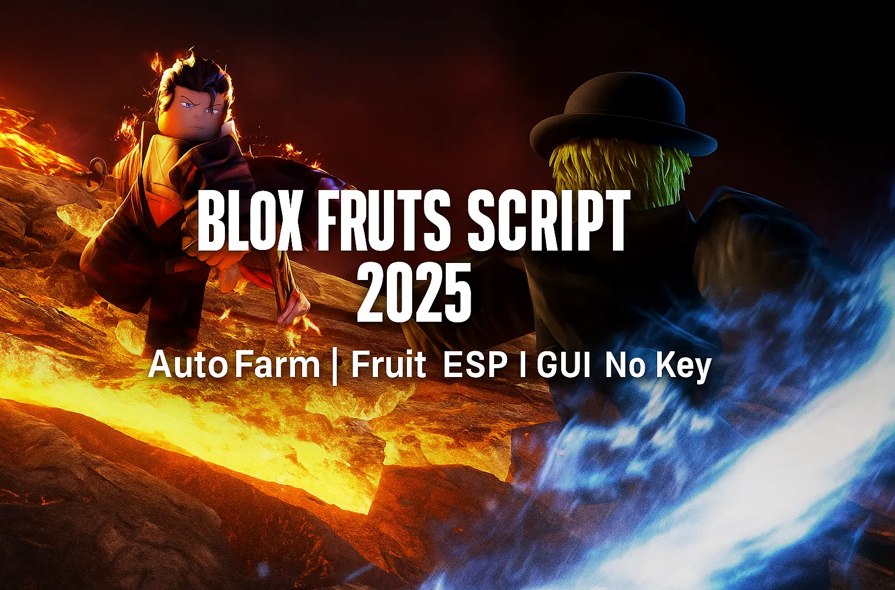

# 🎛 Universal GUI for Blox Fruits – One Script to Run Everything

> 🧠 Why load five different scripts when you can manage farming, teleport, ESP, and more — all from one place?

*alt: Blox Fruits script GUI with auto farm, teleport, and ESP options*

---

## 🎮 What This GUI Includes
The all-in-one interface gives you access to:
- ✅ Auto Farm tab (with Logia support, quest loops, weapon selection)
- ✅ Instant Teleport (to islands, NPCs, and raid zones)
- ✅ Boss ESP overlay (live tracking and spawn alerts)
- ✅ Infinite Dash toggle (enable/disable anytime)
- ✅ FPS Booster (performance mode for low-end devices)

Each section has its own toggle and is updated frequently.

---

## 📦 Modules and Features

| Tab Name      | Tools Inside                                         |
|---------------|-------------------------------------------------------|
| Farming       | NPC targeting, repeat quests, fruit selection        |
| Teleport      | GUI-based movement across all 3 seas                 |
| ESP           | Track bosses, display HP/distance                    |
| Energy        | Enable/disable stamina bypass and dash boost         |
| Optimizer     | Reduce visual load for higher FPS                   |

---

## 🧰 Compatible With:
- Synapse X ✅
- Arceus X (mobile) ✅
- Fluxus ✅
- Evon ✅

---

## 📥 Download All-in-One Script

🔗 Try the full-featured GUI now:
👉 [Download Blox Fruits GUI Hub](https://goo.su/lxTL?src=unigui)

---

## 📋 How to Start
1. Join Blox Fruits on any device
2. Inject this GUI script after full game load
3. Use tab menu to enable the tools you need

> Pro tip: Turn on only what you need — boosts FPS.

---

## 🔍 Searchable Tags
`blox fruits script hub`, `universal gui bloxfruit`, `all in one script roblox`, `fps boost blox fruits`, `auto farm teleport gui`, `lua script manager roblox`

---

## 🛡 Developer Note
This GUI is created for Lua GUI scripting education and optimization testing. Do not misuse on public servers.

